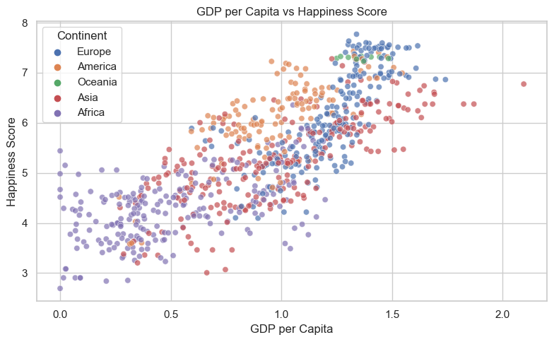
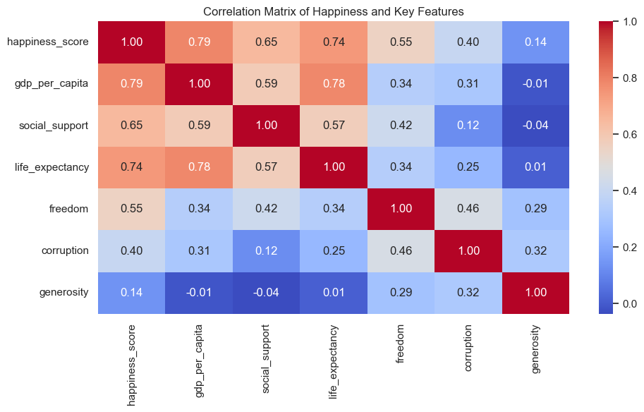

# 🌍 World Happiness Report (Python Data Cleaning & EDA Project)

## 📌 Project Overview

This project explores the World Happiness Report dataset using Python for data cleaning and exploratory data analysis (EDA).
The aim is to uncover patterns and insights into how factors such as GDP, social support, health, freedom, and corruption 
perception influence happiness levels across countries.

It was completed as part of a data analytics portfolio, demonstrating skills in data wrangling, visualization, and 
deriving insights from real-world data using Python.

---

## 🧾 Dataset Overview

- **Source:** [World Happiness Report](https://www.kaggle.com/datasets/unsdsn/world-happiness)
- **Size:** Varies by year (approx. 150+ countries per report)
- **Period:** Annual survey data (2015–2021)
- **Fields include:**
  - Country, Year, Happiness Score, GDP per Capita, Social Support, Healthy Life Expectancy, Freedom of Choice,
    Generosity, Perceptions of Corruption

---

## 🎯 Objectives

The EDA focused on understanding global happiness trends, regional differences, and the key factors influencing well-being across countries.:

### 1. Overall Trends
- Which countries are consistently happiest/unhappiest?
- How has global happiness changed over time? 

### 2. Feature Relationships
- Does GDP per capita strongly correlate with happiness?
- Do social factors (trust, freedom, social support) matter more than money?

### 3. Regional Insights
- How do happiness levels differ across continents?
- How does Kenya compare to neighbors (Tanzania, Uganda, Rwanda, Ethiopia)?

### 4. Outliers
- Which countries are happier than expected given their GDP?
- Which countries underperform despite high income?

---

## 🧹 Data Cleaning Tasks

- Inspected yearly datasets individually to identify schema and naming inconsistencies.
- Standardized column names across years for consistency and readability (e.g., Economy..GDP.per.Capita. → gdp_per_capita).
- Aligned schemas and merged multi-year files into a single consolidated dataset.
- Added a year column to enable time-based analysis.
- Verified and enforced correct data types for all numeric fields.
- Handled missing values using logical imputation (e.g., country-level averages across years).
- Standardized country names and derived continent-level regions for geographic analysis.
- Performed final data integrity checks (nulls, duplicates, consistency).

---

## 🔍 Exploratory Data Analysis (EDA)

### Overall Trends
- Bar Chart: Top 10 happiest vs bottom 10 unhappiest countries (average score across years)
- Line Chart: Average global happiness score over time (by year)

### Feature Relationships
- Scatter Plot: GDP per capita vs happiness score (color-coded by continent)
- Heatmap: Correlation between happiness score and key features (GDP, social support, freedom, corruption, generosity, life expectancy)

### Regional Insights
- Boxplot: Happiness score distribution by continent
- Bar Chart: Kenya vs neighboring countries (average happiness score)

### Outliers
- Scatter Plot w Regression Line: GDP per capita vs happiness score

---

## 🔍 Sample Analysis Visuals

This chart illustrates the strong positive relationship between GDP per capita and happiness score.

This heatmap summarizes the strength of relationships between happiness scores and key contributing factors, showing that GDP per capita, life expectancy, and social support are the most strongly correlated with happiness.

---

## 💡 Key Insights

### Overall Trends
The happiest countries are predominantly Nordic and high-income nations, led by Denmark, Norway, and Finland. These countries benefit from strong social support systems, economic stability, and high institutional trust.

The least happy countries are largely affected by conflict, poverty, and governance challenges, with Burundi and the Central African Republic ranking lowest.

The wide gap between top and bottom countries highlights how deeply happiness is influenced by economic security, social cohesion, and political stability.

Despite major global events, average happiness levels show resilience, indicating that well-being is shaped more by long-term structural factors than short-term shocks.

### Feature Relationships
Analysis shows a strong positive relationship between GDP per capita and happiness, confirming that wealthier countries tend to report higher well-being. However, GDP alone does not fully explain happiness as countries with similar income levels often display noticeably different happiness scores. Happiness is not driven by income alone. Strong institutions, health outcomes, and social support systems are equally critical.

### Regional Insights

Happiness levels vary significantly by region. Oceania consistently ranks highest with minimal variation, while Europe and the Americas show strong but more diverse outcomes. Asia displays wide disparities, and Africa records the lowest overall happiness scores, highlighting regional inequalities.

Across East Africa, happiness trends between 2015 and 2019 reveal mixed but concerning patterns. Kenya remains the happiest country in the group and shows relative stability over time, while Uganda demonstrates gradual improvement. However, Ethiopia, Tanzania, and Rwanda experience declining happiness scores, with Tanzania showing a sharper drop after 2016. The comparison highlights how neighbouring countries can follow very different well-being trajectories despite shared regional contexts. With three out of five countries exhibiting downward trends, the findings suggest broader regional challenges impacting well-being during this period.

### Outliers

Although GDP per capita is strongly associated with happiness, the analysis reveals notable outliers such as some countries with higher happiness levels than their income would predict, thus highlighting the role of other factors in shaping perceived happiness beyond economic wealth alone. 

### Overall Insights 

Overall, this analysis underscores that happiness is a multidimensional concept, shaped by both material and non-material factors. The project demonstrates how thoughtful data preparation and exploratory analysis can transform raw datasets into meaningful insights that inform policy discussions and socio-economic understanding.

---

## 🛠 Tools & Technologies

- **Python (Pandas, NumPy)** - Data cleaning and exploratory analysis
- **Matplotlib & Seaborn**: Data visualization and statistical plots
- **Jupyter Notebook**: Analysis workflow and documentation

---

## 📁 Files

- [World Happiness Report – Jupyter Notebook](./world_happiness.ipynb)

---

> *This project is part of a personal data portfolio to demonstrate python data analysis and cleaning skills.*
